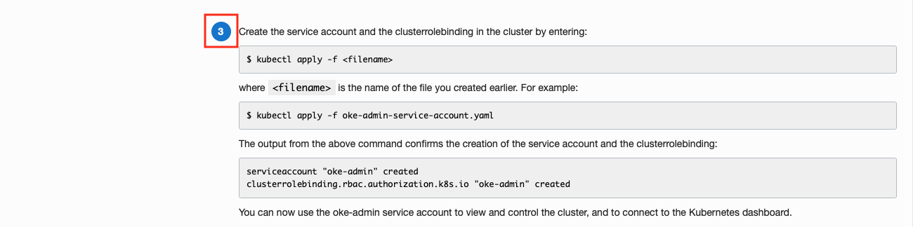
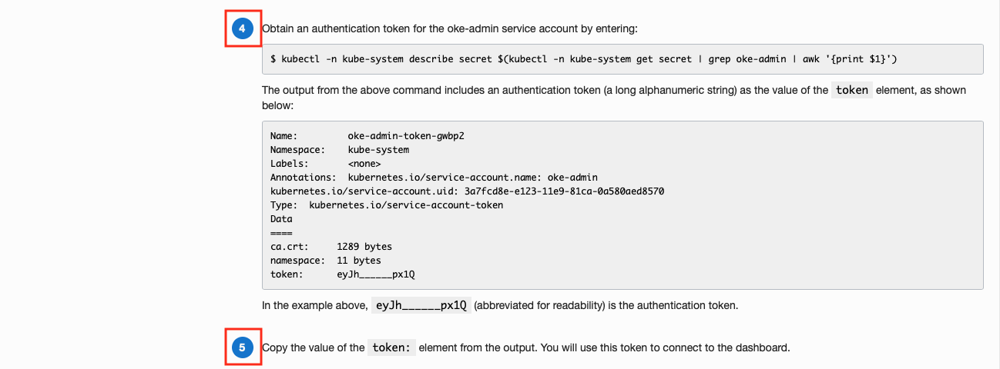
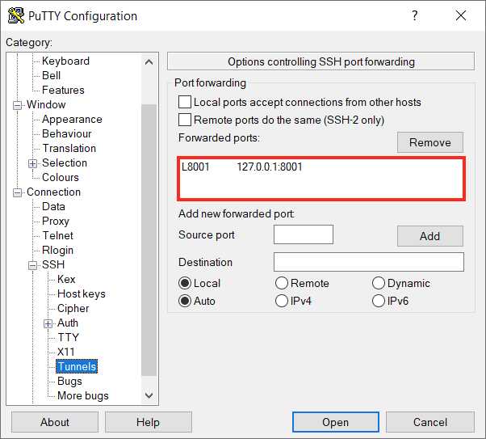
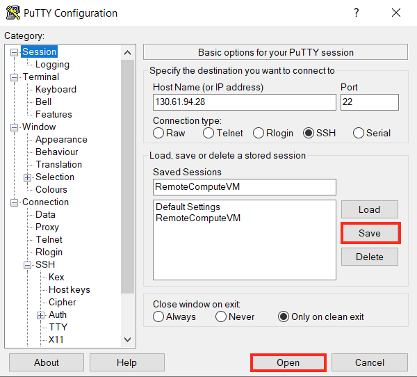
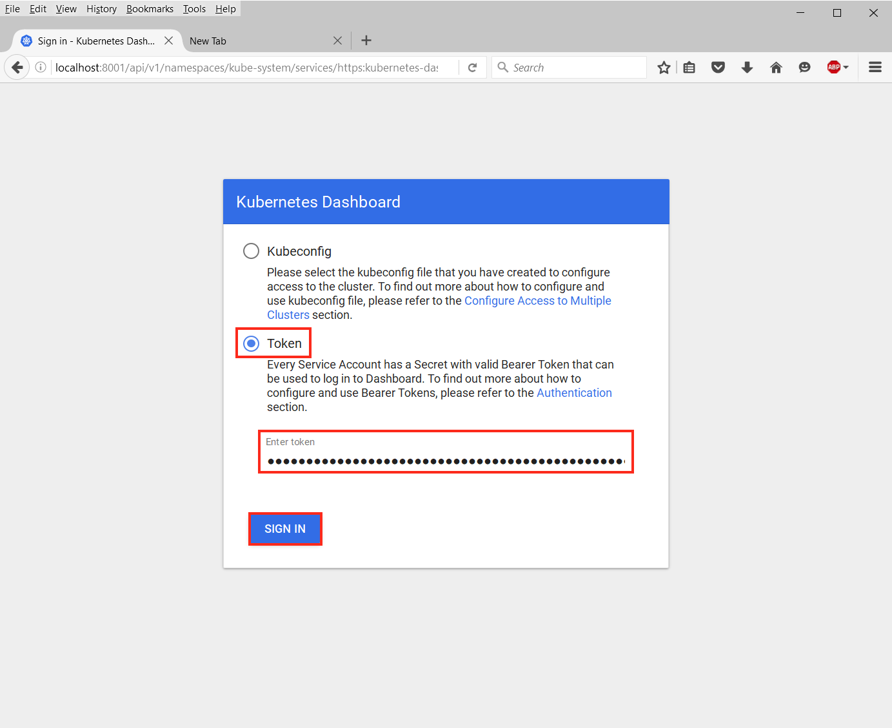
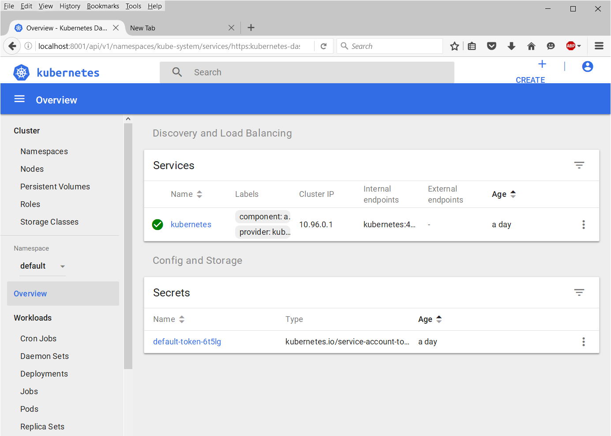

# Lab 12: Setup Kubernetes Dashboard Access (Optional) #

Kubernetes Dashboard is a web-based user interface that you can use as an alternative to the Kubernetes **kubectl** command line tool to:

- deploy containerized applications to a Kubernetes cluster
- troubleshoot your containerized applications

You use the Kubernetes Dashboard to get an overview of applications running on a cluster, as well as to create or modify individual Kubernetes resources. The Kubernetes Dashboard also reports the status of Kubernetes resources in the cluster, and any errors that have occurred. Note that to use the Kubernetes Dashboard, it must have been enabled when the cluster was initially created.

In contrast to the Kubernetes Dashboard, Container Engine for Kubernetes enables you to create and delete Kubernetes clusters and node pools, and to manage the associated compute, network, and storage resources.

## Prerequisites ##

To config the Kubernetes Dashboard for controlling Kubernetes clusters the following steps need to be completed:

- a provisioned Oracle Container Engine for Kubernetes (OKE) cluster
- a provisioned Developer Compute VM on OCI
- a configured **kubectl** command-line tool
- a PuTTY session

## Configuring Kubernetes Dashboard ##

On your OCI Console, open the navigation menu and under **Developer Services**, click **Clusters**. Select your cluster and click to get the detail page.

Click **Access Kubernetes Dashboard** under **Resources** menu on the left.

**Step 1** You do not need to do download the Kubeconfig file again as you have already downloaded this previously during the configuration of the **kubectl** command-line tool.
**Steps 2** Create a file `oke-admin-service-account.yaml` by copying and pasting the content.

**Step 3** Run the following **kubectl** command in your Developer Compute VM.

**Step 4 & 5** Obtain an authentication token by running the **kubectl** command in your Developer Compute VM and copy the token from the command output.

**Step 6** Start your Kubernetes proxy in your Developer Compute VM so that you can access the Kubernetes Dashboard.

In order to access the Kubernetes Dashboard in **Step 7**, you will need to setup a SSL Tunnel to your Developer Compute VM because the **kubectl proxy** is running in your VM and your Browser is running locally on your laptop.

## Configuring a SSL Tunnel with PuTTY ##

This is assuming you are using a Windows environment and you have already configured a PuTTY session to your Developer Compute VM in a previous lab.

Open PuTTY and load your saved session.

Select **Tunnels** from the *Category* options on the left hand pane.

Enter the following values to forward the local port 8001 to the remote Developer Compute VM:

- **Source port:** `8001`
- **Destination:** `127.0.0.1:8001`

Click **Add**

The forwarded port will now appear in the box above.

Make sure you save your changes to your session before you connect to this session.

Then click “Open” to connect to your Developer Compute VM. Login as usual. Now, as long as you leave that SSH terminal window open, all traffic to the Source Port on your localhost will be forwarded on to the Destination.

**Step 7** Open a browser and go to:

    http://localhost:8001/api/v1/namespaces/kube-system/services/https:kubernetes-dashboard:/proxy/#!/login

You should be able to see the Kubernetes Dashboard login page served by the Kubernetes Proxy running in you Developer Compute VM.

Select **Token** and paste the token you copied from **Step 5** into the token field.

Click **Sign In**

If you token is correct, then you should be logged into the Kubernetes Dashboard.

Congratulation, you have successully configured access to your Kubernetes Dashboard for managing your Kubernetes cluster.

### You have completed all labs - [Return Home](domain.home.in.image_short.md) ###
