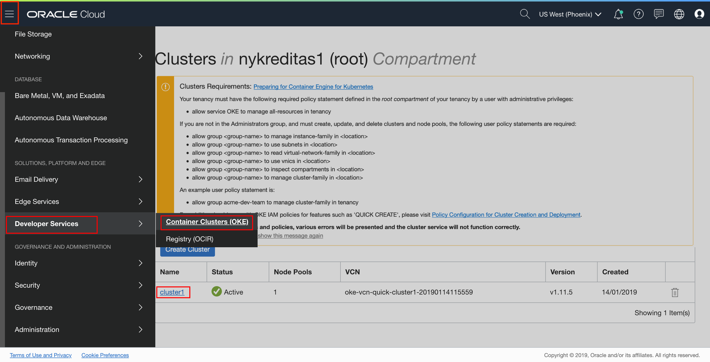
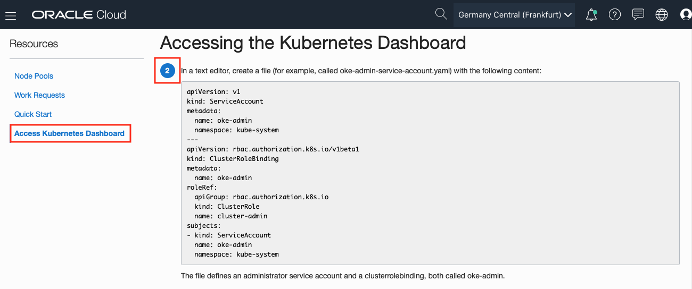

# Lab 12: Setup Kubernetes Dashboard Access (Optional) #

Kubernetes Dashboard is a web-based user interface that you can use as an alternative to the Kubernetes **kubectl** command line tool to:

- deploy containerized applications to a Kubernetes cluster
- troubleshoot your containerized applications

You use the Kubernetes Dashboard to get an overview of applications running on a cluster, as well as to create or modify individual Kubernetes resources. The Kubernetes Dashboard also reports the status of Kubernetes resources in the cluster, and any errors that have occurred. Note that to use the Kubernetes Dashboard, it must have been enabled when the cluster was initially created.

In contrast to the Kubernetes Dashboard, Container Engine for Kubernetes enables you to create and delete Kubernetes clusters and node pools, and to manage the associated compute, network, and storage resources.

## Prerequisites ##

To config the Kubernetes Dashboard for controlling Kubernetes clusters the following steps need to be completed:

- a provisioned Oracle Container Engine for Kubernetes (OKE) cluster
- a provisioned Developer Compute VM on OCI
- a configured **kubectl** command-line tool

## Configuring Kubernetes Dashboard ##

On you OCI Console, open the navigation menu and under **Developer Services**, click **Clusters**. Select your cluster and click to get the detail page.

Click **Access Kubernetes Dashboard** under **Resources** menu on the left.

You do not need to do download the Kubeconfig file again in **Step 1** as you have already downloaded this previously during the configuration of the **kubectl** command-line tool.

Complete the configuration by following **Steps 2 to 9**. Please run the commands in your Developer Compute VM.

In order to access the Kubernetes Dashboard in **Step 7**, you will need to setup a SSL Tunnel to your Developer Compute VM because the **kubectl proxy** is running in your Vm and your Browser is running locally on your laptop.

Congratulation, now your OCI OKE environment is ready to deploy your WebLogic domain.

### You have completed all labs - [Return Home](domain.home.in.image_short.md) ###
